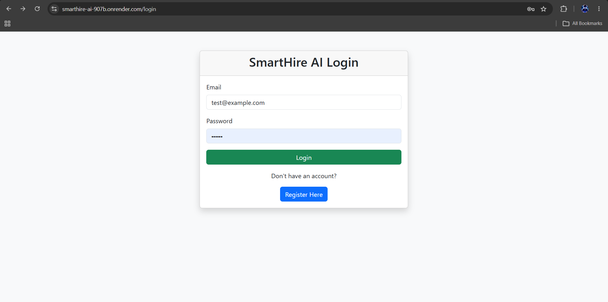
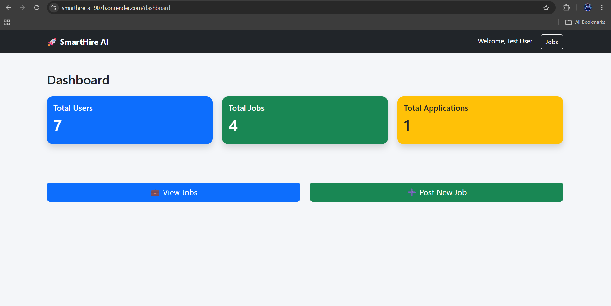
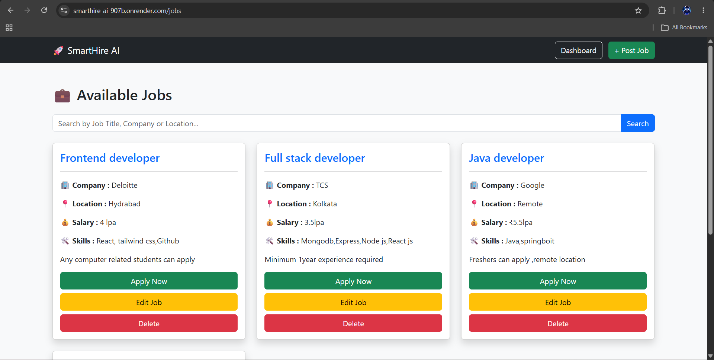
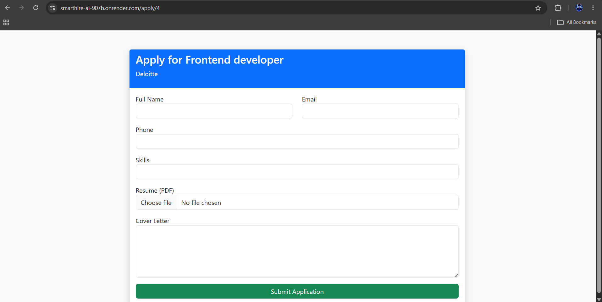

# 🚀 SmartHire AI

A modern Job Portal built using **Node.js, Express.js, PostgreSQL, EJS, Bootstrap, and Render**.

## 🌐 Live Demo

https://smarthire-ai-907b.onrender.com

## 📂 GitHub Repository

https://github.com/shouvik000/SmartHire-AI

---

# ✨ Features

- 🔐 User Registration & Login
- 👤 Session Authentication
- 💼 Post New Jobs
- ✏️ Edit Jobs
- ❌ Delete Jobs
- 🔍 Search Jobs
- 📄 Apply for Jobs
- 📎 Resume Upload
- 🤖 AI Resume Match Score
- 📊 Dashboard
- ☁️ PostgreSQL (Neon Database)
- 🚀 Hosted on Render

---

# 🛠 Tech Stack

Backend
- Node.js
- Express.js

Database
- PostgreSQL (Neon)

Frontend
- EJS
- Bootstrap 5

Authentication
- Express Session

Deployment
- Render

---

# 📁 Folder Structure

SmartHire-AI/

├── config/

├── controllers/

├── middleware/

├── public/

├── routes/

├── uploads/

├── views/

├── app.js

├── package.json

└── README.md

---

# ⚙️ Installation

```bash
git clone https://github.com/shouvik000/SmartHire-AI.git

cd SmartHire-AI

npm install

npm start
```

Create a `.env` file:

```env
DATABASE_URL=YOUR_DATABASE_URL

SESSION_SECRET=YOUR_SECRET

PORT=3000
```

---

# 📸 Screenshots

- Login Page

- Dashboard

- Jobs Page

- Applications Page

- Landing Page


---

# 👨‍💻 Author

**Shouvik Bagdi**

Backend Developer (Node.js)
